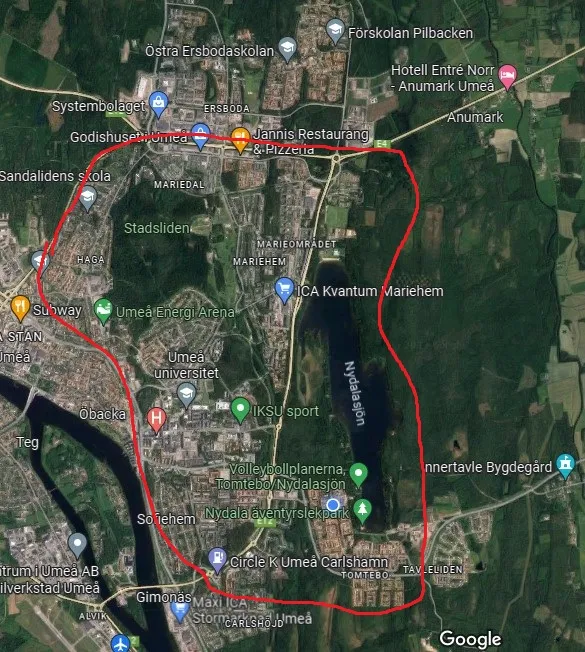
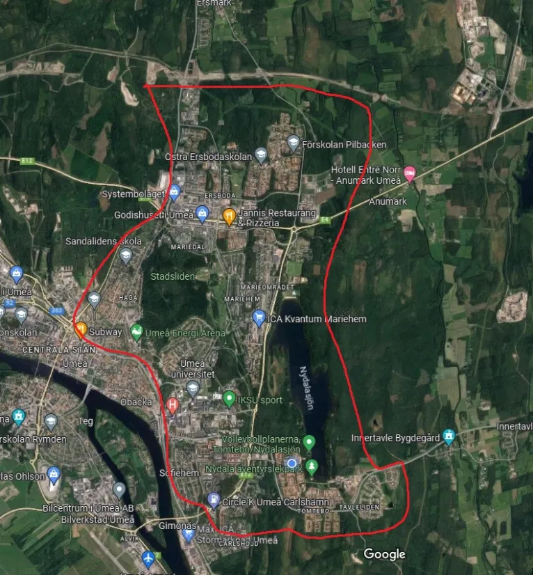

[In English, please! 🙂]()

Det är knappt en vecka kvar och vi längtar att få välkomna er alla till den nordligaste Bonanza någonsin (hittills)! I detta informationsbrev hittar du den viktigaste informationen du behöver innan du ger dig av till Umeå. 

Generell information om Bonanzan hittar du på vår hemsida:

https://www.turfvasterbotten.se/ och på Turf-wiki: https://wiki.turfgame.com/sv/wiki/Bonanza 

## Tjuvstart med turf-träff på Eljest på fredag 19 maj

En av våra sponsorer, [Eljest](https://www.eljestshop.se/), har ett mysigt café/pub som håller öppet för oss på fredag kväll mellan ungefär 18-20 och då erbjuder följande meny:

* Vår rökiga macka, 145 kr (Rågbröd, nykokt potatis, vindelrökt skinka, pepparrot, saltrostade mandlar, serveras med picklad rödkål och salta chips)
* Kantarellmacka (vegansk) 145 kr (Rågbröd, ärtguacamole, stekta kantareller, slätrostade mandlar, persilja, serveras med picklad rödkål och salta chips)
* Kantarellsoppa med grilled cheese 165 kr

**Adress**: Nabbvägen 9 (på ön Ön), närmaste zon är [NabbZone](https://turfgame.com/map/NabbZone).

## Hitta till eventområdet

Eventområdet öppnar kl 9:00 och ligger vid Nydalabadet på norra sidan av Nydalasjön, nära E4:an och First Camp Umeå.

**Hitta hit med:**
* … buss: Ta buss 1 eller 2 mot Ö Ersboda/Ersboda handelsområde och hoppa av på hållplatsen Nydala. Följ cykelvägen under motorvägen, ned mot sjön. För busstidtabeller se[ tabussen.nu](https://www.tabussen.nu/)
* … bil: GPS-koordinatorer 63.837202, 20.339428. Se separat karta för kostnadsfri parkering.
* … turf-kartan: zonerna [TrioVidFyran](https://turfgame.com/map/TrioVidFyran) och [UmeBeach](https://turfgame.com/map/UmeBeach) ligger närmast eventområdet. När du väl hittat hit, lär du även se ett helt gäng andra turfare.  

## Bonanza-tider

* **9:00**\
  Event-området öppnar. Bonanza crew finns på plats och kommer att vara synliga med gula ordensband. Hämta ut din t-shirt (förbeställda) och goodiebag (de 100 första anmälda), byt om, serva din cykel, mingla med Turf Crew och turfare från när och fjärran.
* **9.30**\
  Genomgång inför foot heat
* **10:00-12:00**\
  Heat 1 Bonanza foot
* **Ca 12:20**\
  Crowdy-rekordförsök nr 1
* **Ca 12:30** \
  Prisutdelning för heat 1.*
* **12.40** \
  Genomgång inför bike heat
* **13:00- 15:00** \
  Heat 2  Bonanza Bike
* **Ca 15:20** \
  Crowdy-rekordförsök nr 2
* **Ca 15:30** \
  Prisutdelning för heat 2.*
* **Ca 16:00** \
  Eventområdet stänger.
* **18:00** \
  Fördrinks-crowdy ([se nedan](#1800--fördrink-med-crowdy-inför-banketten))
* **18:30** \
  Bonanza-banketten börjar på Cinco ([se nedan](#1830--bankett-på-restaurang-cinco))
* **21:00** \
  Möjlighet för de som inte anmält sig till banketten att göra oss sällskap på Cinco.

*\*Medaljerna Bonanza Guld, Silver och Brons samt Bonanzamedalj kommer att delas ut i appen efter respektive heat. Vinnarna av respektive heat vinner också priser. Det kommer även att finnas en ungdomsklass, upp till 18 år med särskilda priser.*

## Faciliteter på eventområdet

På eventområdet kommer det att finnas en kiosk med dryck och mat till lagom priser. Stötta gärna föreningen Turf Västerbotten genom att köpa kaffe, dryck, korv, hamburgare (vegetariskt alternativ finns), och annat gott här. Du kan betala med kort eller Swish.

Vi är mycket glada att vår sponsor CM Cykel och Fritid kommer att finnas på plats på eventområdet och reparera/serva cyklar mot en billig penning samt sälja hjälmar och andra cykeltillbehör.

På eventområdet kommer det även finnas tillgång till toaletter, omklädningsrum och förvaring.

## Crowdy-rekord på samlingsplatsen

Vad vore en Bonanza utan försök att ta Crowdy-rekord? Dvs att flera turfare tar assist på en zontagning samtidigt. Nuvarande rekord är 194 personer vilket togs på Bonanzan i Västervik 2022. När detta skrivs är 223 turfare anmälda vilket ger goda chanser på både få medaljen crowdy-144 och slå rekordet, men detta kräver lite koordination. Vi har planerat in två försök klockan 12:20 och 15:20 i samband med prisutdelning av de två heaten. Vi uppmuntrar er därför att inte ta zonen mellan 12:01-12:20 samt mellan 15:01-15:20.

## Säkerhet

Som vid varje turf-event ber vi er att vara uppmärksamma ute i trafiken. Följ trafikreglerna och visa hänsyn till medtrafikanter och gående. Du deltar på eget ansvar. Använd gärna lysande färger (t.ex. gult) på dina kläder. I cykel-heatet är cykelhjälm en stark rekommendation.

På eventområdet finns hjärtstartare, första hjälpen-kit och plåster. Du kan alltid nå Bonanza Crew på 010-475 33 66 (linkaz) 070-605 6605 (inda7) ifall något händer under ditt heat. Behöver du akut hjälp – ring först 112.

## Bra att veta

Det råder cykelförbud i Stadsliden (det gröna området norr om universitetet).

Umeå är björkarnas stad och snart kommer staden explodera i björkpollen. Är du känslig kan det vara en god idé att ta med medicin.

## 18:00 – fördrink med crowdy inför banketten

Klockan 18:00 bjuder vi på fördrink och crowdy inför banketten. Vi ses utanför badhuset Navet, nära Elite hotell, närmst zonen NavetZone och går sedan i gemensam trupp till banketten.

## 18:30 – bankett på restaurang Cinco

Kl 18:30 öppnas dörrarna till banketten på [restaurang Cinco](https://cincoumea.se/) på Renmarkstorget (närmsta zon: [RenastLuft](https://turfgame.com/map/RenastLuft)). Observera att deltagande på banketten kräver föranmälan och att anmälningen nu har stängt. Kontakta Bonanza Crew på eventområdet om du vill skriva upp dig på reservlista (obs! Då gäller ordinarie meny och ej specialkost, priset är 400 kr). ***Du som inte anmält dig är välkommen att göra oss sällskap på Cinco efter 21:00.***

I middagen ingår huvudrätt och efterrätt på Västerbottniskt tema. Dryck bekostas på egen hand. Under kvällen blir det utdelning av Turf Awards, upptåg, Regionskampen ([se nedan](#regionskampen--bonanza-edition)), tillkännagivande av Bonanza-ort 2024 och mycket mer. Hela lokalen är reserverad för Bonanza-festligheterna fram till 21.30.

Ca kl 21:30 kommer den formella delen av banketten att rundas av och vi kommer att flytta in i en mindre avdelning i bakre delen av Cinco. Kl 22:00 slår nattklubben på Cinco upp dörrarna och några av er vill kanske passa på att svänga de lurviga. Åldersgräns för nattklubben är 22 år, då gäller entrépris.

## Regionskampen – Bonanza edition

Utmana Stockholm i vem som är bästa Turf-regionen i Regionskampen Bonanza edition. Vi håller öppet för anmälan tills tidsschemat är fullt, men som allra senast kl 16:00 när eventområdet stänger. 

Maila din anmälan till bonanza@turfvasterbotten.se alternativt ta kontakt med WombaWomba eller UncleFester på eventområdet.

## Frågor och kontakt?

Har du ytterligare frågor och funderingar, tveka inte att höra av dig till bonanza@turfvasterbotten.se eller skicka oss ett meddelande i chatten (Västerbotten/Sverige/World).

Under tävlingsdagen kan ni nå Bonanza Crew med akuta frågor. Ring 010-475 33 66 (linkaz) eller 070-605 6605 (inda7).

## Kom ihåg att packa badkläder!

Det går nämligen att bada – både på Nydalabadet och på Navet. Så packa gärna badkläder!

## Tack till våra samarbetspartners och sponsorer 

[CM Cykel och Fritid](https://www.cmcykel.se/), [Visit Umeå](https://visitumea.se/sv), [Föreningsbyrån](https://www.umea.se/upplevaochgora/foreningarforeningsliv/foreningsbyranstodtillforeningar.4.250f9659174ae4b9794529.html), [First Camp Umeå](https://firstcamp.se/destinationer/nydala-umea), [Hotell Gamla Fängelset](https://www.hotellgf.se/), [Eljest](https://www.eljestshop.se/), [Cinco](https://cincoumea.se/), [NRA Repro AB](https://nra.se/), [Tiljan](https://www.tiljan.se/) och [Innovationssluss Västerbotten](https://www.regionvasterbotten.se/innovation-och-partnerskap/innovationssluss-vasterbotten).

## Karta: Hitta till eventområdet (inkl. kostnadsfri parkering)

## Karta: Tävlingområde Foot

## Karta: Tävlingområde Bike

