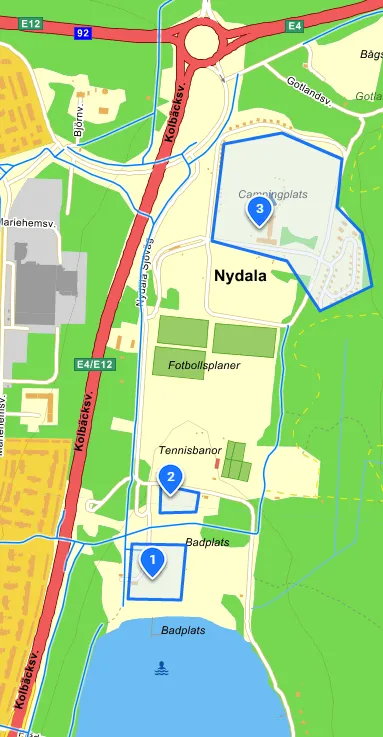

It’s barely a week left and we cannot wait to welcome you all to the northernmost Bonanza ever (so far)! In this information letter you will find the essential information you need before setting off to Umeå. 

General information about the Bonanza can be found on our webpage:

https://www.turfvasterbotten.se/ and on the Turf-wiki page: https://wiki.turfgame.com/en/wiki/Bonanza 

## Warm-up at Eljest on Friday evening, 19 May

One of our sponsors, Eljest, has a cosy café/pub which will stay open specially for turfers on Friday evening approx. between 18-20. They offer the following menu this night:

* Our smokey sandwich, 145 SEK (rye bread, freshly cooked potatoes, Vindel smoked ham, horseradish, salted roasted almonds, served with pickled red cabbage and salty crisps)
* Chanterelle sandwich (vegan) (vegansk) 145 SEK (rye bread, guacamole on peas, fried chantarelles, roasted almonds, parsley, served with pickled red cabbage and salty crisps)
* Chantarelle soup with grilled cheese 165 SEK 

**Address**: Nabbvägen 9 (on the island Ön), the closest zone is [NabbZone](https://turfgame.com/map/NabbZone).

## Find the event area

The event area opens at 9 AM and is located by Nydalabaded, on the north side of the Nydala lake. It is close to the E4 and First Camp Umeå.

**Get here by:**

* … bus: Take bus 1 or 2 towards Ö Ersboda/Ersboda handelsområde and get off at the stop Nydala. Follow the bike lane under the motorway, towards the lake. For timetables see [tabussen.nu](https://www.tabussen.nu/)
* … car: GPS-coordinates 63.837202, 20.339428. See also attached map for parking.
* … the turf map: the zones [TrioVidFyran](https://turfgame.com/map/TrioVidFyran) and [UmeBeach](https://turfgame.com/map/UmeBeach) are the closest ones. When you've reached these, you are highly likely to see plenty of other turfers. 😉 

## Bonanza-tider

* **9:00**\
  The event area opens. The Bonanza crew will be present and identifiable through their yellow sashes. Get your pre-ordered t-shirt and goodiebag (the first 100 turfers who signed up for the event). Get your bike checked, switch clothes and mingle with Turf Crew and turfers from near and afar.
* **9.30**\
  Briefing before the foot heat
* **10:00-12:00**\
  Heat 1 Bonanza foot
* **Ca 12:20**\
  Crowdy record attempt no 1
* **Ca 12:30** \
  Prize ceremony for heat 1.*
* **12.40** \
  Briefing before the bike heat
* **13:00- 15:00** \
  Heat 2  Bonanza Bike
* **Ca 15:20** \
  Crowdy record attempt no 2
* **Ca 15:30** \
  Prize ceremony for heat 2.*
* **Ca 16:00** \
  The event area will be closed.
* **18:00** \
  Warm-up drink and crowdy (see below)
* **18:30** \
  The bonanza banquet begins at restaurant Cinco (see below)
* **21:00** \
  For those who did not sign up for the banquet, you’re welcome to join us at Cinco from 21:00.

*\*The medals Bonanza Gold, Silver och Bronze and Bonanza Participator will be assigned automatically in the app directly after each heat. Winners of each heat will also receive physical prizes. There will also be special prizes for participants of the junior class (up to 18).*

## Facilities at the event area

At the event area we have a kiosk where you can purchase food and beverages for reasonable prices. Please support the association Turf Västerbotten by purchasing coffee, sodas, sausages, burgers (vegetarian option available) and other tasty items here. You can pay with card or Swish.

We are very happy that our sponsor CM Cykel och Fritid will be present at the event area and serve bikes for an affordable fee an sell bike helmets and other cycle accessories.

At the event area you will find toilets, changing rooms and storage.

## Crowdy record attempts

What is a Bonanza without attempting to break the Crowdy record? A crowdy is when several turfers takes assist on a zone simultaneously. Current record is 194 turfers, which was taken at the Bonanza in Västervik. We currently have 223 turfers signed up for the Bonanza so the prospects looks good for both the medal crowdy-144 and to break the record. However, this requires some coordination. We have planned for two attempts, at 12:20 and 15:20, in connection to the prize ceremonies after the two heats. We ask you kindly not to take the zone between 12:01-12:20 and 15:01-15:20.

## Your safety

Like any other Turf event, we ask you to be cautious in the traffic. Follow Swedish traffic rules and be respectful to other people. Please note that you participate at your own risk. We recommend using bright coloued clothes (e.g. yellow). We also strongly recommend wearing a helmet in the cycle heat.

See also: https://www.thenewbieguide.se/cycling-rules-in-sweden/

At the event area you can find defibrillator, first aid kit and bandaid. You can always contact Bonanza Crew if something happens during your heat. +46 (0) 10-475 33 66 (linkaz) or +46 (0)70-605 6605 (inda7). If you need emergency help always first call 112 (for ambulance, police and/or emergency services)..

## Good to know

In the area called Stadsliden (the green forest area north of the university) cycling is prohibited.

Umeå is the city of birch trees, very soon all birches will explode in a pollen bonanza. If you are allergic, we recommend bringing medicine.

Thursday (18 May) is a public holiday, which means that stores and public transport may run at a different schedule than usual.

## 18:00 – – warm-up drink with crowdy

Klockan 18:00 bjuder vi på fördrink och crowdy inför banketten. Vi ses utanför badhuset Navet, nära Elite hotell, närmst zonen NavetZone och går sedan i gemensam trupp till banketten.

## 18:30 – banquet at restaurant Cinco

At 18:30 the doors will open to the banquet at restaurant Cinco at Renmarkstorget (closest zone: RenastLuft). Please note that participation at the banquet requires pre-registration which has now closed. If you wish to be on the standby list, please contact Bonanza Crew at the event area (please note that we in such case cannot accommodate allergies or special requirements, the price is 400 SEK). ***If you have not signed up for the banquet, you are welcome to join us at Cinco after 21:00.***

The dinner includes a main course and dessert on a Västerbotnian theme. Beverages are at your own expense. Some of the happenings during the evening includes: Turf Awards, the Ultimate Region Fight “Bonanza Banquet Edition” (see below), announcement of Bonanza 2024, and other fun activities. The whole restaurant is reserved for the festivities until 21:30.

The formal part of the banquet ends around 21:30. We will then move into a smaller section of the restaurant. At 22:00 Cinco’s night club will open. Some of you may wish to dance through the night. You must be 22 years old to enter the nightclub, entrance fee applies.

## The Ultimate Region Fight – Bonanza Banquet Edition

Who will challenge Stockholm as the number 1 Turf region in our Bonanza version of the Ultimate Region Fight? It is still possible to sign up. We’ll draw the line when the banquet’s time schedule is full, but at the latest 16:00 when the event area closes.

Read more: https://www.turfvasterbotten.se/post/ultimate-region-fight-bonanza-edition/ 

Email your region’s delegation to bonanza@turfvasterbotten.se, or get in touch with WombaWomba or UncleFester at the event area.

## Questions and contact?

Still have questions? Please do not hesitate to contact us at bonanza@turfvasterbotten.se or send us a chat message in the Turf app (Västerbotten/Sverige/World).

If you have urgent questions or issues on the event day you can get in touch with the Bonanza Crew. Call +46 (0)10-475 33 66 (linkaz) or +46(0) 70-605 6605 (inda7).

## Remember to pack your swimwear!

It is possible to take a swim – both at Nydalabadet and at the swimming centre Navet. So bring your swimming suits!

## Thank you to our partners and sponsors

[CM Cykel och Fritid](https://www.cmcykel.se/), [Visit Umeå](https://visitumea.se/sv), [Föreningsbyrån](https://www.umea.se/upplevaochgora/foreningarforeningsliv/foreningsbyranstodtillforeningar.4.250f9659174ae4b9794529.html), [First Camp Umeå](https://firstcamp.se/destinationer/nydala-umea), [Hotell Gamla Fängelset](https://www.hotellgf.se/), [Eljest](https://www.eljestshop.se/), [Cinco](https://cincoumea.se/), [NRA Repro AB](https://nra.se/), [Tiljan](https://www.tiljan.se/) och [Innovationssluss Västerbotten](https://www.regionvasterbotten.se/innovation-och-partnerskap/innovationssluss-vasterbotten).

## Map: Find the event area (and free parking)

## Map: Competition Area Foot

## Map: Competition Area Bike

